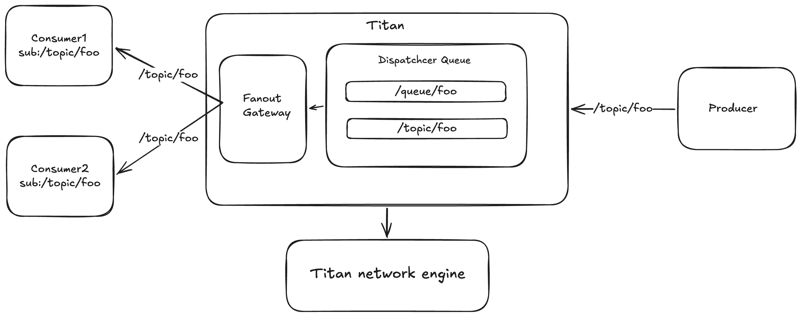

# Titan

Titan is a lightweight message dispatch platform focused on STOMP over TCP.
It provides a fast NIO-based server, destination routing, fanout delivery, and a Spring client integration for application developers.

## Why Titan

- Low-latency message delivery on a custom event-loop based transport layer.
- Destination-based routing (`/queue/foo`, `/topic/bar`) with strict destination validation.
- STOMP server engine with configurable protocol and transport options.
- Pluggable runtime via SPI (`NetworkServerEngineProvider`, `FanoutLauncher`).
- Spring Boot integration (`@EnableTitan`, `TitanTemplate`, `@TitanListener`) for easy adoption.

## Where It Fits Best

Titan is best suited for real-time, in-memory dispatch scenarios where speed and integration simplicity are more important than durable storage.

- Internal event bus between services in a private network.
- Real-time notifications, chat-style messaging, collaboration updates.
- IoT/device telemetry fanout to multiple subscribers.
- Gaming/live interaction backends that need fast publish-subscribe dispatch.

Titan is currently not positioned as a durable queue/broker replacement (no built-in persistence/replay semantics documented in this repository).

## Architecture



## Core Design

1. Bootstrap phase
   `TitanBootstrap` reads `titan-env.yml` and maps it to `Settings`/`ServerSettings`.

2. Engine selection phase
   `TitanApplication` loads `NetworkServerEngineProvider` implementations via `ServiceLoader` and selects one by `protocol` + `transport`.

3. Extension phase
   `FanoutLauncher` implementations are discovered by `ServiceLoader` and attached to managed servers when supported.

4. Runtime phase
   Event loops + channel pipelines process inbound/outbound frames and dispatch by destination.

## Quick Start

### Prerequisites

- JDK 21+
- Gradle wrapper (`./gradlew`)

### 1) Configure server

Default config file is `./titan-env.yml` (or JVM property `-Dtitan.environment.path=/path/to/file.yml`).

```yaml
titan:
  servers:
    - name: stomp-dispatch
      protocol: stomp
      host: 0.0.0.0
      port: 61613
      transport-options:
        reuse-address: "true"
        child-tcp-no-delay: "true"
      protocol-options:
        supported-versions: "1.2"
        max-body-length: "1048576"
        heartbeat-x: "1000"
        heartbeat-y: "1000"
        fanout-mode: "virtual"
```

### 2) Verify build and tests

```bash
./gradlew test
```

### 3) Run smoke integration test

```bash
./gradlew :smoke-test:smoke-spring:test
```

This test boots Titan using `TitanBootstrap` and validates Spring-side subscribe/send scenarios.

## Spring Client Integration

`titan-spring-client` provides an annotation-driven integration layer.

### Enable Titan in your Spring app

```java
@EnableTitan
@SpringBootApplication
public class Application {
    public static void main(String[] args) {
        SpringApplication.run(Application.class, args);
    }
}
```

### Configuration properties (`spring.titan.*`)

Important options:

- `host`, `port`
- `auto-start`, `auto-connect`
- `connect-timeout-millis`
- `heartbeat-x`, `heartbeat-y`
- `login`, `passcode`, `virtual-host`

Example:

```yaml
spring:
  titan:
    auto-start: true
    auto-connect: true
    host: 127.0.0.1
    port: 61613
    login: guest
    passcode: guest
    virtual-host: guest
```

## Current Strengths

- Protocol/transport-specific engine abstraction through SPI.
- Clear separation between bootstrap, core runtime, STOMP protocol layer, and Spring adapter.
- Route key validation for predictable destination contracts.
- Fanout mode abstraction (`virtual`, `thread-pool`) for different concurrency strategies.

## Current Scope and Limits

- Primary production focus in this repository is STOMP over TCP.
- Reliability strategies such as nack/retry/error-policy in Spring listener container are still evolving.
- Monitoring module currently provides JMX collectors; full operational dashboards/alerts are out of scope here.

## Project Modules

- `bootstrap`: startup, environment loading, lifecycle bootstrap.
- `core`: transport/event loop/channel/dispatcher/concurrency primitives.
- `titan-stomp`: STOMP codec, STOMP server/client transport, STOMP engine provider.
- `fanout`: fanout gateway and exporter implementations.
- `monitor`: JMX metric collectors (heap/cpu/thread).
- `titan-spring-client`: Spring Boot auto-configuration and listener/template API.
- `smoke-test`: Spring smoke application and integration tests.
- `benchmark`: JMH benchmark setup.

## Roadmap Suggestions

- Add explicit error handler + nack/retry policy for Spring listener container.
- Expand test coverage in low-test modules (`bootstrap`, `monitor`).
- Add CI workflows for build + test + smoke test on pull requests.
- Add a deployment/operations guide (health checks, thread sizing, protocol tuning).

## License

MIT License. See [LICENSE](LICENSE).
