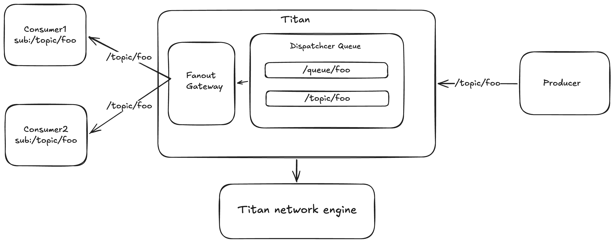

<p align="center">
  
</p>

# Titan

[](https://github.com/traffic-hunter/titan/releases)
[](https://central.sonatype.com/artifact/org.traffichunter.titan/titan-stomp)
[](https://github.com/traffic-hunter/titan/actions/workflows/ci.yml)

Titan is a lightweight message dispatch platform focused on STOMP over TCP and
WebSocket.
It provides a custom NIO transport, destination routing, fanout delivery, and
Spring Boot client integration.

## Highlights

- STOMP over TCP server and client.
- STOMP over WebSocket for native, Vert.x, and Spring clients.
- Transport-neutral `TitanClient` facade with reconnect and subscription recovery.
- TLS transport support through PKCS12 or JKS key stores.
- Exact destination matching with one FIFO dispatcher queue per destination.
- Fanout delivery for publish-subscribe scenarios.
- Pluggable runtime through SPI.
- Local HTTP monitoring API with a terminal-first CLI.
- Spring Boot integration with `TitanTemplate` and `@TitanListener`.

Titan is best suited for real-time, in-memory dispatch scenarios such as
notifications, chat-style messaging, telemetry fanout, and live interaction
backends. It is not an in-process event bus and is not currently positioned as a
durable queue/broker replacement.

## Installation

Titan artifacts are published to Maven Central.

```kotlin
repositories {
    mavenCentral()
}
```

Spring client:

```kotlin
implementation("org.traffichunter.titan:titan-spring-client:0.7.4")
```

Standalone Java client:

```kotlin
implementation("org.traffichunter.titan:titan-client:0.7.4")
```

STOMP server and low-level transport APIs:

```kotlin
implementation("org.traffichunter.titan:titan-stomp:0.7.4")
```

Fanout support:

```kotlin
implementation("org.traffichunter.titan:titan-fanout:0.7.4")
```

Monitoring support:

```kotlin
implementation("org.traffichunter.titan:titan-monitor:0.7.4")
```

Bootstrap/runtime support:

```kotlin
implementation("org.traffichunter.titan:titan-bootstrap:0.7.4")
implementation("org.traffichunter.titan:titan-core:0.7.4")
```

## Java Client

`TitanClient` is the public client facade. It hides the native and Vert.x STOMP
implementations behind the same asynchronous API.

```java
import java.nio.charset.StandardCharsets;
import java.util.concurrent.TimeUnit;
import org.traffichunter.titan.client.TitanClient;
import org.traffichunter.titan.core.util.buffer.Buffer;

TitanClient client = TitanClient.builder()
        .host("127.0.0.1")
        .port(61613)
        .build();

try {
    client.start();
    client.connect()
            .thenCompose(ignored -> client.subscribe(
                    "/notifications",
                    frame -> System.out.println(
                            new String(frame.body(), StandardCharsets.UTF_8)
                    )
            ))
            .thenCompose(ignored -> client.send(
                    "/notifications",
                    Buffer.alloc("hello titan")
            ))
            .get(30, TimeUnit.SECONDS);
} finally {
    client.shutdown(30, TimeUnit.SECONDS);
}
```

The native implementation is selected by default. Use
`implementation(TitanClient.Implementation.VERTX)` to select Vert.x without
changing the messaging API. After an unexpected connection loss, the client
uses its configured reconnect policy and restores active subscriptions before
reporting itself as connected again.

## Standalone Server

Download the executable server jar from GitHub Releases.

Using `curl`:

```bash
curl -L -o titan-server-0.7.4.jar \
  https://github.com/traffic-hunter/titan/releases/download/0.7.4/titan-server-0.7.4.jar
```

Using `wget`:

```bash
wget -O titan-server-0.7.4.jar \
  https://github.com/traffic-hunter/titan/releases/download/0.7.4/titan-server-0.7.4.jar
```

Create `titan-env.yml`.

```yaml
titan:
  monitor:
    enabled: true
    host: 127.0.0.1
    port: 7777
    # token: change-me
  servers:
    - name: stomp-dispatch
      protocol: stomp
      host: 0.0.0.0
      port: 61613
      transport-options:
        reuse-address: "true"
        child-tcp-no-delay: "true"
      protocol-options:
        supported-versions: "1.2"
        max-body-length: "1048576"
        heartbeat-x: "1000"
        heartbeat-y: "1000"
        fanout-mode: "virtual"
```

To expose STOMP over WebSocket, set `transport: websocket` and configure the
upgrade path under `transport-options`.

```yaml
      transport: websocket
      port: 8080
      transport-options:
        path: "/stomp"
```

TLS is configured separately from transport and protocol options.

```yaml
      tls:
        side: server
        client-auth: none
        path: /etc/titan/server.p12
        type: PKCS12
        store-password: store-secret
        key-password: key-secret
```

Run Titan.

```bash
java -Dtitan.environment.path=./titan-env.yml -jar titan-server-0.7.4.jar
```

Inspect the running server from a terminal. The release page provides
prebuilt `titan-cli-<version>-<os>-<arch>.tar.gz` archives, or you can run the
CLI from source while developing.

```bash
# prebuilt archive example
tar -xzf titan-cli-0.7.4-linux-amd64.tar.gz
./titan --addr http://localhost:7777

# source checkout example
cd titan-cli
go run . --addr http://localhost:7777
go run . --addr http://localhost:7777 --view queues
go run . --addr http://localhost:7777 --view jvm --interval 1s --timeout 3s
go run . --addr http://localhost:7777 --no-color --once

# queue management
export TITAN_MONITOR_TOKEN=<monitor-token>
go run . --addr http://localhost:7777 queue list
go run . --addr http://localhost:7777 queue create /orders --capacity 100
go run . --addr http://localhost:7777 queue delete /orders
go run . --addr http://localhost:7777 queue delete /orders --force
```

The monitor HTTP API is served under `/titan`.

```bash
curl http://localhost:7777/titan/monitor/health
curl http://localhost:7777/titan/monitor/snapshot
curl http://localhost:7777/titan/monitor/queues
```

## Examples

- [Spring client usage](./docs/examples/spring-client.md)
- [Java client usage](./docs/examples/client.md)
- [Server usage](./docs/examples/server.md)

## Architecture



1. `TitanBootstrap` reads `titan-env.yml` and builds runtime settings.
2. `TitanApplication` selects protocol/transport engines through `ServiceLoader`.
3. `FanoutLauncher` implementations attach optional fanout behavior.
4. Event loops and channel pipelines process frames and dispatch messages.

## Published Modules

- `titan-bootstrap`: loads `titan-env.yml` and starts Titan runtime modules.
- `titan-core`: provides event loop, channel, transport, and runtime primitives.
- `titan-stomp`: provides STOMP codec, server, and low-level transport integration.
- `titan-client`: provides the public `TitanClient` facade with native and Vert.x drivers.
- `titan-fanout`: routes one published message to all matching subscribers.
- `titan-monitor`: exposes JVM and dispatcher queue monitoring snapshots.
- `titan-spring-client`: provides Spring Boot auto-configuration, `TitanTemplate`, and `@TitanListener`.

## Repository Modules

- `bootstrap`: startup, environment loading, lifecycle bootstrap.
- `core`: transport/event loop/channel/dispatcher/concurrency primitives.
- `titan-stomp`: STOMP codec, server, and low-level client transport.
- `titan-client`: transport-neutral client facade, drivers, reconnect, and subscription recovery.
- `fanout`: fanout gateway and exporter implementations.
- `monitor`: monitoring snapshot model, JMX collectors, and Jetty HTTP endpoint.
- `titan-cli`: Go CLI for rendering monitoring snapshots in the terminal.
- `titan-spring-client`: Spring Boot auto-configuration and listener/template API.
- `smoke-test`: smoke applications and integration tests.
- `benchmark`: JMH benchmark setup.

## Development

Requirements:

- JDK 21+
- Gradle wrapper (`./gradlew`)
- Go 1.22+ for `titan-cli`

Run tests:

```bash
./gradlew test
```

Run smoke tests:

```bash
./gradlew :smoke-test:smoke-spring:test
./gradlew :smoke-test:smoke-titan:test
```

Build the standalone server jar:

```bash
./gradlew :bootstrap:shadowJar
```

## Scope

- Primary production focus is STOMP over TCP and WebSocket.
- Titan is a networked dispatch/fanout runtime, not an in-process event bus.
- Reliability strategies such as nack/retry/error-policy in Spring listener container are still evolving.
- Monitoring currently focuses on local JVM and dispatcher queue visibility.

## Contributors

Thanks to everyone who has contributed to Titan.

<a href="https://github.com/traffic-hunter/titan/graphs/contributors">
  
</a>

See the full [GitHub contributors list](https://github.com/traffic-hunter/titan/graphs/contributors).

## License

MIT License. See [LICENSE](LICENSE).
