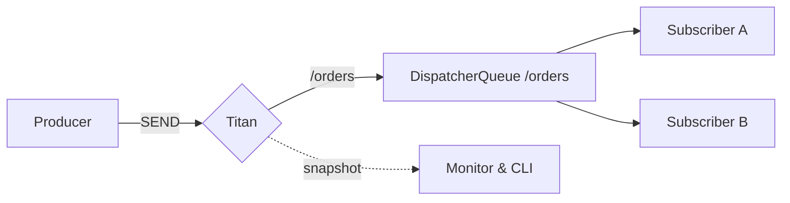

# Messages in motion

Titan is a lightweight message dispatch platform built around **STOMP over
TCP**, destination routing, and observable in-memory delivery.


**CONNECT → SEND → ROUTE → DELIVER** 
One compact runtime for live messages, fanout, and operational visibility.


## Choose your path

<table data-view="cards"><thead><tr><th></th><th></th><th></th><th data-hidden data-card-target data-type="content-ref"></th></tr></thead><tbody>
<tr>
  <td><h3><i class="fa-bolt" style="color:$primary;">:bolt:</i></h3></td>
  <td><strong>Start in five minutes</strong></td>
  <td>Launch a node, verify its health, and send your first message.</td>
  <td><a href="quickstart.md">quickstart</a></td>
</tr>
<tr>
  <td><h3><i class="fa-diagram-project" style="color:$primary;">:diagram-project:</i></h3></td>
  <td><strong>Understand the runtime</strong></td>
  <td>Follow a STOMP frame through transport, routing, fanout, and delivery.</td>
  <td><a href="concepts/how-titan-works.md">how Titan works</a></td>
</tr>
<tr>
  <td><h3><i class="fa-spring" style="color:$primary;">:spring:</i></h3></td>
  <td><strong>Build with Spring</strong></td>
  <td>Publish with <code>TitanTemplate</code> and consume with <code>@TitanListener</code>.</td>
  <td><a href="examples/spring-client.md">Spring Boot</a></td>
</tr>
</tbody></table>

## One runtime, three views


{% column width="60%" %}
### Build

Run from `titan-env.yml`, embed the STOMP server, or connect with the native
Java and Spring Boot clients.

### Route

Address live traffic with opaque destination paths. Titan maps every exact
destination to one FIFO dispatcher queue; path prefixes do not change delivery
semantics.


{% column width="40%" %}

### Observe

Inspect health, JVM state, connections, and dispatcher queues from HTTP or the
terminal-first Titan CLI.




## See the signal move


Titan focuses on fast, real-time, in-memory dispatch. It is not currently a
durable queue or broker replacement. Review [Project scope](reference/project-scope.md)
before using Titan for reliability-sensitive workloads.


## Explore the system

<table data-view="cards"><thead><tr><th></th><th></th><th></th><th data-hidden data-card-target data-type="content-ref"></th></tr></thead><tbody>
<tr>
  <td><h3><i class="fa-route" style="color:$primary;">:route:</i></h3></td>
  <td><strong>Dispatch routing</strong></td>
  <td>Trace exact destination keys through FIFO dispatcher queues.</td>
  <td><a href="concepts/destinations.md">destinations</a></td>
</tr>
<tr>
  <td><h3><i class="fa-arrows-split-up-and-left" style="color:$primary;">:arrows-split-up-and-left:</i></h3></td>
  <td><strong>Fanout</strong></td>
  <td>Dispatch one live publication to every matching subscriber.</td>
  <td><a href="concepts/fanout.md">fanout</a></td>
</tr>
<tr>
  <td><h3><i class="fa-wave-pulse" style="color:$primary;">:wave-pulse:</i></h3></td>
  <td><strong>Monitoring and CLI</strong></td>
  <td>See node health and dispatcher pressure without leaving the terminal.</td>
  <td><a href="operate/monitoring.md">monitoring</a></td>
</tr>
</tbody></table>

Documentation examples target Titan `0.7.3` and JDK 21 or newer.
