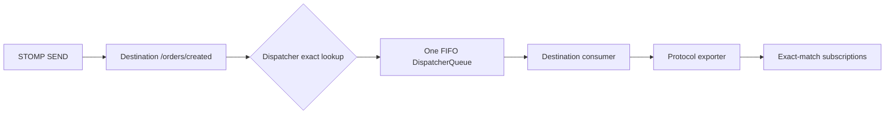

# Destinations and dispatcher queues

A destination is an opaque path key that connects an inbound message to one
Titan dispatcher queue. Titan does not interpret `/queue` and `/topic` prefixes
as separate messaging models.


`/orders`, `/events/orders`, and `/topic/orders` are all ordinary destination
keys to Titan. Their names communicate application intent only; they do not
change routing behavior.


## The routing invariant

Every published message is placed into the queue for its exact destination.
If that queue does not exist yet, the dispatcher creates it.



The default dispatcher stores destination queues in a trie, but publishing is
an exact lookup. A message for `/orders/created` is not routed to `/orders` and
does not inherit behavior from any path prefix.

## Queue lifecycle

The first publish or consumer startup for a destination calls `getOrPut` and
creates its queue when necessary. Repeated calls for the same destination reuse
the existing queue and preserve its configured capacity.

Each queue:

* belongs to exactly one destination;
* preserves insertion order with FIFO delivery;
* can be paused and resumed;
* exposes its size and capacity to monitoring;
* can be created or deleted through the monitoring API and Titan CLI.

This is an internal dispatch queue. It is not a STOMP `/queue` destination with
competing-consumer semantics, and the destination name does not turn it into
one.

## Subscription matching

STOMP subscriptions are registered with a destination. During export, Titan
selects subscriptions whose `Destination` value is exactly equal to the queue's
destination. The subscription registry does not perform prefix or topic-pattern
matching.

```text
SEND      /events/orders
SUBSCRIBE /events/orders     → match
SUBSCRIBE /events            → no match
SUBSCRIBE /events/payments   → no match
```

When fanout is enabled, the per-destination consumer drains one message from the
dispatcher queue and the exporter writes that message to every exact-match
subscription. Learn more in [Fanout](fanout.md).

## Naming destinations

Choose names for domain meaning, not broker semantics:

```text
/orders
/orders/created
/rooms/42/messages
/devices/temperature
```

Use stable nouns and events. Avoid `/queue` or `/topic` unless those words are
genuinely part of your application's domain language; Titan assigns them no
special behavior.
