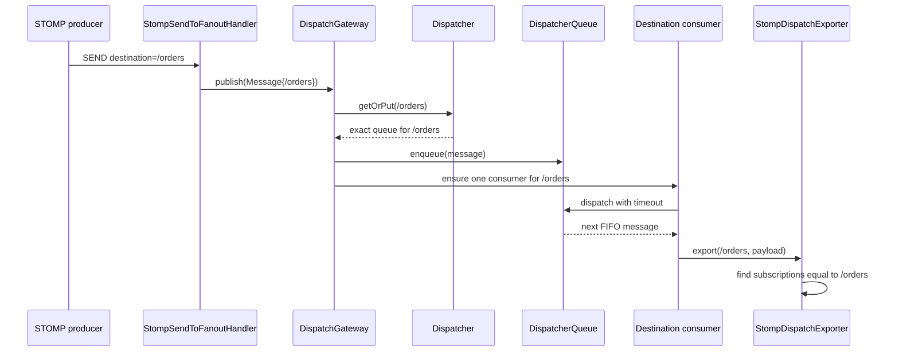

# Dispatch routing

Titan's fanout runtime routes messages by **exact destination identity**. A
destination is a validated path stored in `Destination`; it is not classified
as a queue or topic from its prefix.

```text
/orders
/orders/created
/events/notifications
```

All three are ordinary routing keys. `/queue/orders` and `/topic/orders` are
also valid strings, but `queue` and `topic` have no reserved meaning inside the
dispatcher.

## The publish path

With `fanout-mode` enabled, Titan replaces the STOMP server's default `SEND`
handler with `StompSendToFanoutHandler`. One inbound frame then follows this
path:



The implementation divides this into two handler-chain stages:

1. `RouteDispatchChainHandler` invokes `DispatchGateway.route(message)`.
2. `FanoutDispatchChainHandler` ensures that the destination consumer is
   running.

Custom handlers are inserted between those stages. This allows backup,
validation, or metrics work after routing and before consumer startup without
putting protocol logic inside the queue.

## How a queue is selected

`DispatchGateway.route` does not search for the nearest path, a topic pattern,
or every matching prefix. It performs this operation:

```java
Destination destination = message.getDestination();
DispatcherQueue queue = dispatcher.getOrPut(destination);
queue.enqueue(message);
```

Consequently:

| Published destination | Selected dispatcher queue |
| --- | --- |
| `/orders` | `/orders` |
| `/orders/created` | `/orders/created` |
| `/orders/cancelled` | `/orders/cancelled` |

Even though these keys share a trie prefix, they are three independent queues.
Publishing to `/orders/created` never falls back to the `/orders` queue.


`Dispatcher.searchAll("/orders/*")` is a queue discovery operation that returns
descendant queues. The publish path never calls `searchAll`; wildcard lookup is
not message routing. Do not use a wildcard destination in `SEND` expecting
broadcast behavior.


## Queue creation and capacity

`getOrPut` atomically returns the existing queue or creates one for the exact
destination. A queue created by normal publishing uses
`DispatcherQueue.DEFAULT_CAPACITY`, currently `11` messages.

You can create the queue before traffic arrives and choose its capacity:

```bash
titan --addr http://localhost:7777 queue create /orders --capacity 100
```

Queue creation is idempotent. If `/orders` already exists, a later create call
returns that queue and does not replace its original capacity.

The queue is a bounded FIFO `LinkedBlockingQueue` and is the handoff point
between producers and the destination consumer:

* enqueue preserves insertion order;
* pause blocks new enqueue attempts until resume;
* size and capacity are exposed through monitoring and JMX;
* non-empty deletion is rejected unless force deletion is requested;
* force deletion clears pending messages and stops the current consumer;
* publishing after deletion creates a new queue instance.

`enqueue` can refuse a message when a bounded queue is full. Titan's current
fanout path does not provide durable retry or persistence for that refusal, so
capacity and queue pressure must be monitored.

## One consumer per destination

`DispatchGateway` keeps a concurrent map of destination to consumer task.
`computeIfAbsent` guarantees at most one active queue-draining task for each
destination inside that gateway.

The consumer polls its queue and invokes the configured `DispatchExporter` one
message at a time. This preserves FIFO processing within one destination while
allowing different destination consumers to progress independently on the
gateway executor.

The `publish()` future represents completion of the dispatch handler chain and
consumer-start request. It does **not** mean that every remote subscriber has
received or acknowledged the message.

## How subscriptions match

After a message leaves the queue, `StompDispatchExporter` asks the server's
subscription registry for subscriptions whose `Destination` is exactly equal
to the message destination.

```text
Message destination       Subscription destination       Result
/orders                    /orders                        match
/orders/created            /orders                        no match
/orders                    /orders/*                      no match
```

For every exact match, the exporter creates a separate STOMP `MESSAGE` frame
and copies the subscription id into its headers. This is the fanout step: one
message drained from one dispatcher queue can be written to multiple matching
subscriptions.

If there are no exact-match subscriptions, the exporter has no recipients. The
message has already been removed from the in-memory queue; Titan does not retain
it for a future subscriber.

## Fanout mode versus the default STOMP handler

The dispatcher-queue path described above is installed when `fanout-mode` is
configured. Without that adapter, Titan's default STOMP `SEND` handler looks up
exact-match subscriptions and writes to them directly; it does not pass the
frame through `DispatchGateway` or a `DispatcherQueue`.

For the standalone configuration documented here, enable fanout explicitly:

```yaml
titan:
  servers:
    - name: stomp-dispatch
      protocol: stomp
      protocol-options:
        fanout-mode: "virtual"
```

This distinction matters when embedding the STOMP server: installing
`StompSendToFanoutHandler` is what connects inbound `SEND` frames to Titan's
dispatcher routing pipeline.
